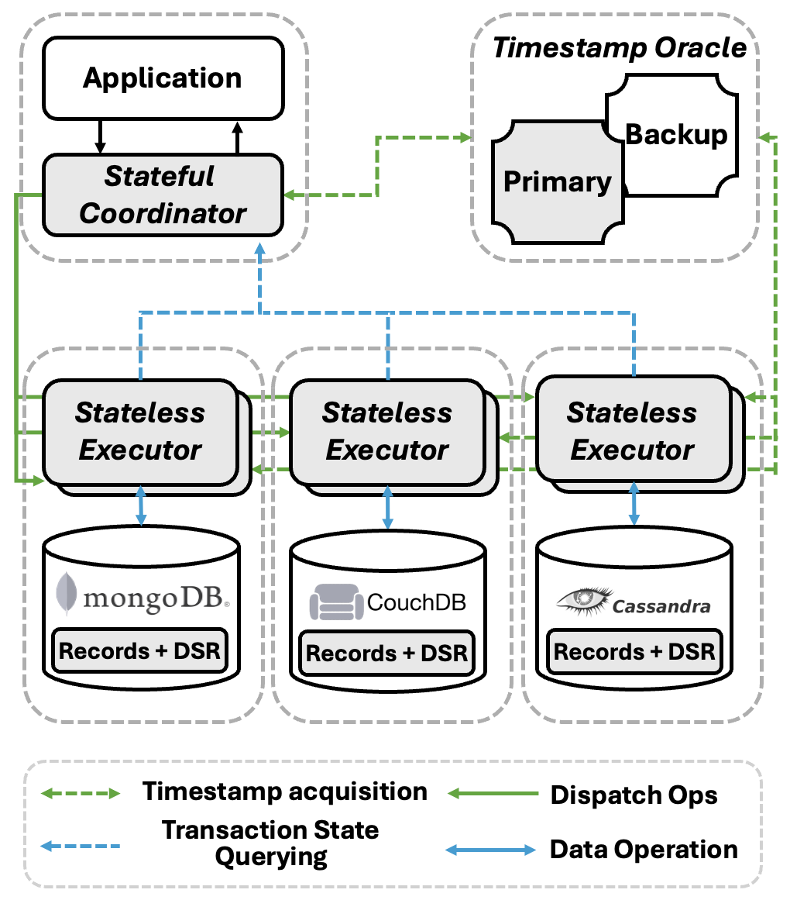

# Oreo

[](https://goreportcard.com/report/github.com/kkkzoz/oreo)
[](https://pkg.go.dev/github.com/kkkzoz/oreo)
[](https://github.com/kkkzoz/oreo/actions/workflows/golangci-lint.yml)
[](https://opensource.org/licenses/MIT)

<div align="center">
  
</div>

## Table of Contents

- [Oreo](#oreo)
  - [Table of Contents](#table-of-contents)
  - [Introduction](#introduction)
    - [Why Use Oreo?](#why-use-oreo)
    - [How It Works](#how-it-works)
  - [Oreo Structure](#oreo-structure)
  - [Project Structure](#project-structure)
  - [For Contributors](#for-contributors)
  - [License](#license)

## Introduction

Oreo is a high-performance, scalable transaction framework designed for modern applications that rely on multiple, heterogeneous NoSQL data stores. It provides robust ACID guarantees for distributed transactions without the performance bottlenecks of traditional centralized coordinators.

### Why Use Oreo?

Managing data integrity across distributed systems is a significant challenge. Oreo is engineered to solve this problem with a focus on performance, scalability, and resilience.

- **True Atomicity Across Databases**: Ensure that a series of operations across different NoSQL stores either all succeed or all fail.  This eliminates the risk of data inconsistencies that can arise from partial failures in complex business logic.

- **Built for Scale**: Oreo's architecture features a separation of stateful and stateless components. This allows the data-handling part of the system (the Stateless Executors) to be scaled horizontally and independently, with performance scaling nearly linearly as new nodes are added.

- **Exceptional Performance**: By decentralizing coordination, Oreo significantly reduces communication overhead.

- **Decentralized and Resilient**: Oreo eliminates the single point of failure common in centralized systems.  Its components are designed for high availability, enabling rapid recovery from failures with minimal impact on system operations.

- **Broad NoSQL Support**: The framework is designed to be agnostic to the underlying database technology. The prototype includes support for Redis, KVRocks, MongoDB, CouchDB, and Cassandra.

### How It Works

Oreo's innovative approach is based on two fundamental design principles:

- **Distributed State Record (DSR)**: Instead of a central transaction log, Oreo co-locates a partial transaction state, the DSR, with the application data in each participating database.  The final outcome of a transaction is then inferred from the collective state of these DSRs, avoiding the bottlenecks of a centralized model.

- **Stateful-Stateless Architecture**: Oreo decouples the transaction logic from data execution.
  - A lightweight **Stateful Coordinator** is integrated directly into your application, where it manages the transaction's lifecycle.
  - **Stateless Executors** are deployed alongside your databases to perform the actual read/write operations. This separation allows for independent scaling and improves fault isolation.

## Oreo Structure

<div align="center">
  
</div>

## Project Structure

- `./benchmarks`: All code related to benchmark testing
- `./executor`: Code for the Stateless Executor
- `./ft-executor`: Code for the Fault-Tolerant Executor
- `./ft-timeoracle`: Code for the Fault-Tolerant Timeoracle
- `./integration`: Code for the Integration Tests (Broken due to the latest changes)
- `./internal`: Internal classes
- `./pkg`: All code related to Oreo
- `./script`: Scripts for automation and testing (Unused)
- `./timeoracle`: Code for the Timeoracle

Documentation can be found [here](https://pkg.go.dev/github.com/kkkzoz/oreo).

## For Contributors

We use `pre-commit` hooks to ensure code quality and consistency. We highly recommend installing it to check your commits before pushing.

**Setup**

1. Install pre-commit:
You can install it using `pip` or other package managers.

```bash
pip install pre-commit
```

2. Set up the Git hooks:
From the root of the repository, run the following command to install the git hooks:

```bash
pre-commit install
```

Now, `pre-commit` will run automatically each time you make a commit. If any checks fail, the commit will be aborted. Please fix the reported issues, `git add` the changed files, and commit again.

## License

This project is licensed under the MIT License. See the [LICENSE](./LICENSE) file for details.
