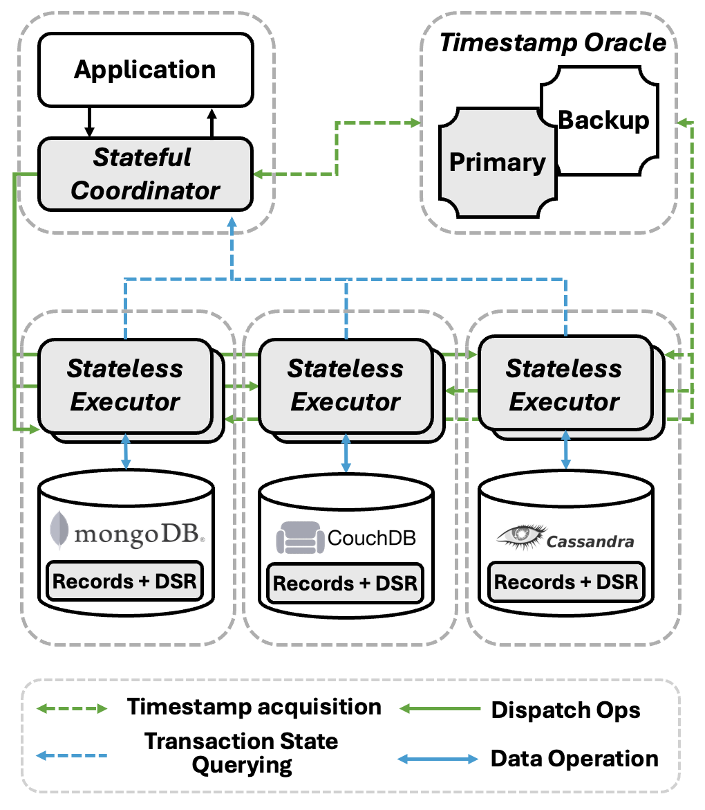

# Oreo: High-Performance and Scalable Transactions across Heterogeneous NoSQL Data Stores

[](https://goreportcard.com/report/github.com/oreo-dtx-lab/oreo)
[](https://pkg.go.dev/github.com/oreo-dtx-lab/oreo)
[](https://opensource.org/licenses/MIT)


<div align="center">


</div>


## Oreo

Oreo: High-Performance and Scalable Transactions across Heterogeneous NoSQL Data Stores

This repository is dedicated to sharing the implementation of Oreo for the ASPLOS 2025 paper entitled: Oreo: High-Performance and Scalable Transactions across Heterogeneous NoSQL Data Stores.


## Oreo Structure




## Project Structure

+ `./benchmarks`: All code related to benchmark testing
+ `./executor`: Code for the Stateless Executor
+ `./integration`:  Code for integration tests
+ `./internal`: Internal classes
+ `./pkg`: All code related to Oreo

Documentation can be found [here](https://pkg.go.dev/github.com/oreo-dtx-lab/oreo).


## Evaluation

### Command Line Parameters

Below are descriptions of all command parameters for the benchmark application.

You can switch to the `./benchmarks/cmd` directory and generate the corresponding binary file using `go build .`, or compile and run it directly using `go run .`.

```bash
Usage of ./benchmarks/cmd:
  -d string
        DB type
  -help
        Show help
  -m string
        Mode: load or run (default "load")
  -ps string
        Preset configuration for evaluation
  -read string
        Read Strategy (default "p")
  -remote
        Run in remote mode (for Oreo series)
  -t int
        Thread number (default 1)
  -trace
        Enable trace
  -wc string
        Workload configuration path
  -wl string
        Workload type
```

Below are detailed descriptions for each option.

`-d`: Required parameter to select the database type for the current test. The available types are:

+ `redis`: Native Redis data operations
  + Suitable workload: `ycsb`
  + Database address: `RedisDBAddr`
+ `oreo-redis`: Redis data operations under the Oreo framework, supporting distributed ACID transactions
  + Suitable workload: `ycsb`
  + Database address: `OreoRedisAddr`
+ `mongo`: Native MongoDB data operations
  + Suitable workload: `ycsb`
  + Database address: `MongoDBAddr1`
+ `oreo-mongo`: MongoDB data operations under the Oreo framework, supporting distributed ACID transactions
  + Suitable workload: `ycsb`
  + Database address: `OreoMongoDBAddr1`
+ `native-rm`: Native data operations with a Redis-MongoDB combination
  + Suitable workload: `multi-ycsb`
  + Database addresses: `RedisDBAddr` and `MongoDBAddr1`
+ `native-mm`: Native data operations with a MongoDB-MongoDB combination
  + Suitable workload: `multi-ycsb`
  + Database addresses: `MongoDBAddr1` and `MongoDBAddr2`
+ `oreo-rm`: Supporting distributed ACID transactions with a Redis-MongoDB combination
  + Suitable workload: `multi-ycsb`
  + Database addresses: `OreoRedisAddr` and `OreoMongoDBAddr1`
+ `oreo-mm`: Supporting distributed ACID transactions with a MongoDB-MongoDB combination
  + Suitable workload: `multi-ycsb`
  + Database addresses: `OreoMongoDBAddr1` and `OreoMongoDBAddr2`


`-m`: Required parameter to set the mode of execution, which can be `load` or `run`.

+ `load`: Loads the corresponding data for the specified database type.
+ `run`: Starts the performance benchmark test.

`-ps`: Optional parameter, default is empty, sets the preset parameters, which can be found in `main.go`.

+ `cg`: Parameters for the Cherry Garcia protocol. If you want to test Cherry Garcia, please specify this option.
+ `native`: Parameters for native data operations.

`-read`: Optional parameter, default is `p`, sets the transaction read strategy under the Oreo framework.

+ `p`: Uses the pessimistic read strategy.
+ `ac`: Uses the Assume-Committed strategy.
+ `aa`: Uses the Assume-Aborted strategy.


`-remote`: Specifies whether to use a Stateless Executor for data operations. The Executor's address can be configured in `./benchmarks/pkg/config/config.go`.

`-t`: Required parameter, sets the number of threads for the test.

`-trace`: Specifies whether to enable Go's built-in trace analysis.

`-wc`: Required parameter, sets the workload configuration path for the test.


Below are some command line examples:

```bash
# Load data to redis using 100 threads
go run . -d redis -wl ycsb -wc ./workloads/workloada.yaml -m load -t 100
# Load data to oreo-redis using 100 threads
go run . -d oreo-redis -wl ycsb -wc ./workloads/workloada.yaml -m load -t 100

# Running with native-rm under workload A
go run . -d native-rm -wl multi-ycsb -wc ./workloads/workloada.yaml -m run -ps native -t 128
# Running with oreo-mm under workload F
go run . -d oreo-mm -wl multi-ycsb -wc ./workloads/workloadf.yaml -m run -remote -t 128
# Running with oreo-mm under workload F in Cherry Garcia
go run . -d oreo-mm -wl multi-ycsb -wc ./workloads/workloada -m run -ps cg -t 128
```

### Getting Started

This section will introduce how to run a benchmark from scratch.

1. **Clone the Repository**: 

    First, clone the entire repository.

```bash
git clone git@github.com:oreo-dtx-lab/oreo.git
```

2. **Modify Relevant Configurations**:
   - Database addresses, usernames, and passwords are located in `./benchmarks/cmd/main.go`.
   - Stateless Executor addresses are located in `./benchmarks/pkg/config/config.go`.

3. **Compile the Stateless Executor**:
   Compile the Stateless Executor.

```bash
cd ./executor
go build .
```

4. **Deploy and Run the Executor**:
   Distribute the Executor to the database nodes and run it.

> The Executor also has a few simple command line parameters:

> + `-p`: Sets the HTTP server port.
> + `-r1`: Specifies the address of the `redis1` database.
> + `-m1`: Specifies the address of the `mongo1` database.
> + `-m2`: Specifies the address of the `mongo2` database.

```bash
./executor -m1 mongodb://localhost:27017 -m2 mongodb://localhost:27018
```

5. **Select and Check Workload Configuration**:
   Determine the workload you want to run and check its configuration. Workload configuration files are located in `./benchmarks/cmd/workloads` and are written in YAML format. Below is a template of a workload configuration.
```yaml
# Total number of records to be generated
recordcount: 1000000

# Total number of operations to be performed
operationcount: 100000

# Number of operations in each transaction group
txnoperationgroup: 6

# Proportions of different operations
readproportion: 0.5 # Proportion of read operations
updateproportion: 0.5 # Proportion of update operations
insertproportion: 0 # Proportion of insert operations
scanproportion: 0 # Proportion of scan operations
readmodifywriteproportion: 0 # Proportion of read-modify-write operations

# Proportions of operations on different databases
redis1proportion: 0.5 # Proportion of operations on Redis instance 1
mongo1proportion: 0.5 # Proportion of operations on MongoDB instance 1
mongo2proportion: 0 # Proportion of operations on MongoDB instance 2
couchdbproportion: 0 # Proportion of operations on CouchDB
```

6. **Load Data into the Database**:
   Load data into the database. Note that different types of databases have different addresses.

> Note: Database combinations such as `oreo-mm`, `oreo-rm`, `native-mm`, and `native-rm` do not support direct data loading. Please run separate load commands for each database independently. For example, for `oreo-rm`, run:
>
> ```bash
> # Load data to redis
> go run . -d oreo-redis -wl ycsb -wc ./workloads/workloada.yaml -m load -t 100
> # Load data to mongo
> go run . -d oreo-mongo -wl ycsb -wc ./workloads/workloada.yaml -m load -t 100
> ```


```bash
# Load data to redis using 100 threads
go run . -d redis -wl ycsb -wc ./workloads/workloada.yaml -m load -t 100
# Load data to oreo-redis using 100 threads
go run . -d oreo-redis -wl ycsb -wc ./workloads/workloada.yaml -m load -t 100
```

7. **Run the Benchmark**:
   Execute the benchmark. Below are some examples for reference.

```bash
# Running with native-rm under workload A
go run . -d native-rm -wl multi-ycsb -wc ./workloads/workloada.yaml -m run -ps native -t 128
# Running with oreo-mm under workload F
go run . -d oreo-mm -wl multi-ycsb -wc ./workloads/workloadf.yaml -m run -remote -t 128
# Running with oreo-mm under workload F in Cherry Garcia
go run . -d oreo-mm -wl multi-ycsb -wc ./workloads/workloada.yaml -m run -ps cg -t 128
# Running with oreo-redis under purewrite workload using Assume-Abort strategy
go run . -d oreo-redis -wl ycsb -wc ./workloads/purewrite.yaml -m run -remote -read aa -t 128
```

8. **Wait for Benchmark Completion**:
   Once the benchmark completes, you should see output similar to the following:

```bash
-----------------
DBType: oreo-mm
Mode: run
WorkloadType: multi-ycsb
ThreadNum: 128
Remote Mode: true
Read Strategy: p
ConcurrentOptimizationLevel: 2
AsyncLevel: 2
MaxOutstandingRequest: 5
MaxRecordLength: 3
HTTPAdditionalLatency: 3ms ConnAdditionalLatency: 0s
LeaseTime: 100ms
ZipfianConstant: 0.9
-----------------
Start to run benchmark
----------------------------------
Run finished, takes 9.403273025s
COMMIT - Takes(s): 9.4, Count: 9528, OPS: 1017.9, Avg(us): 25863, Min(us): 8296, Max(us): 100223, 50th(us): 24175, 90th(us): 37567, 95th(us): 42975, 99th(us): 56383, 99.9th(us): 77183, 99.99th(us): 99391
COMMIT_ERROR - Takes(s): 9.4, Count: 7112, OPS: 759.9, Avg(us): 20556, Min(us): 4516, Max(us): 91903, 50th(us): 19151, 90th(us): 31583, 95th(us): 35839, 99th(us): 47615, 99.9th(us): 65535, 99.99th(us): 87999
READ   - Takes(s): 9.4, Count: 97334, OPS: 10355.1, Avg(us): 7597, Min(us): 6, Max(us): 85631, 50th(us): 5951, 90th(us): 13351, 95th(us): 16975, 99th(us): 25935, 99.9th(us): 39359, 99.99th(us): 57951
READ_ERROR - Takes(s): 9.3, Count: 2666, OPS: 285.3, Avg(us): 12612, Min(us): 3968, Max(us): 79039, 50th(us): 9943, 90th(us): 23375, 95th(us): 29071, 99th(us): 40735, 99.9th(us): 60511, 99.99th(us): 79039
Start  - Takes(s): 9.4, Count: 16768, OPS: 1782.8, Avg(us): 58, Min(us): 20, Max(us): 5515, 50th(us): 32, 90th(us): 62, 95th(us): 82, 99th(us): 593, 99.9th(us): 2723, 99.99th(us): 4759
TOTAL  - Takes(s): 9.4, Count: 247132, OPS: 26280.6, Avg(us): 11487, Min(us): 1, Max(us): 186879, 50th(us): 4119, 90th(us): 50623, 95th(us): 70079, 99th(us): 91391, 99.9th(us): 115391, 99.99th(us): 139519
TXN    - Takes(s): 9.4, Count: 9528, OPS: 1017.8, Avg(us): 71551, Min(us): 31552, Max(us): 166399, 50th(us): 69695, 90th(us): 91135, 95th(us): 98687, 99th(us): 114687, 99.9th(us): 136447, 99.99th(us): 153343
TXN_ERROR - Takes(s): 9.4, Count: 7112, OPS: 760.0, Avg(us): 68862, Min(us): 27232, Max(us): 157567, 50th(us): 66815, 90th(us): 88959, 95th(us): 96831, 99th(us): 113663, 99.9th(us): 134527, 99.99th(us): 155775
TxnGroup - Takes(s): 9.4, Count: 16640, OPS: 1773.8, Avg(us): 70293, Min(us): 22240, Max(us): 186879, 50th(us): 68607, 90th(us): 90623, 95th(us): 98559, 99th(us): 115327, 99.9th(us): 140415, 99.99th(us): 162431
UPDATE - Takes(s): 9.4, Count: 97334, OPS: 10353.6, Avg(us): 7, Min(us): 1, Max(us): 3601, 50th(us): 4, 90th(us): 6, 95th(us): 7, 99th(us): 17, 99.9th(us): 1314, 99.99th(us): 2675
Error Summary:

  Operation:  COMMIT
       Error   Count
       -----   -----
prepare phase failed: Remote prepare failed
  version mismatch  6281
prepare phase failed: Remote prepare failed
rollForward failed
  version mismatch  515
prepare phase failed: Remote prepare failed
rollback failed
  version mismatch  315
prepare phase failed: Remote prepare failed
  read failed due to unknown txn status  1

                             Operation:   READ
                                  Error  Count
                                  -----  -----
  read failed due to unknown txn status   1333
rollForward failed
  version mismatch  826
rollback failed
  version mismatch  507
```

The test output is mainly divided into three sections:

+ **Configuration Information**
  + Details of the test configuration.

+ **Performance Metrics**
  + This section provides the timing data for each operation during the test, including the average, maximum, minimum, 50th percentile, 95th percentile, 99th percentile, 99.9th percentile, and 99.99th percentile values.

+ **Error Log Information**
  + This section records the number and reasons for all transaction operation errors during the test.


### Note

+ If you need to test Cherry Garcia, please use the `-ps cg` parameter.
+ The default simulated latency is 3ms. If you need to adjust the simulated latency, please modify the value in `./benchmark/pkg/config/config.go`.


### Evaluation Results

Our Evaluation results can be found [here](./Evaluation%20Results.md).


## License

This project is licensed under the MIT License. See the [LICENSE](./LICENSE) file for details.